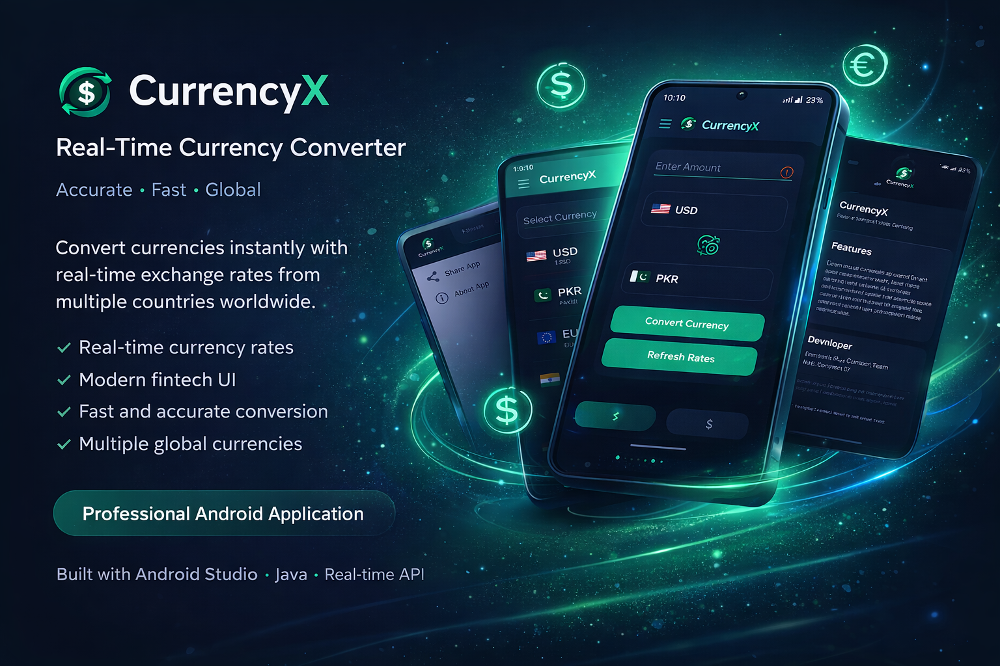
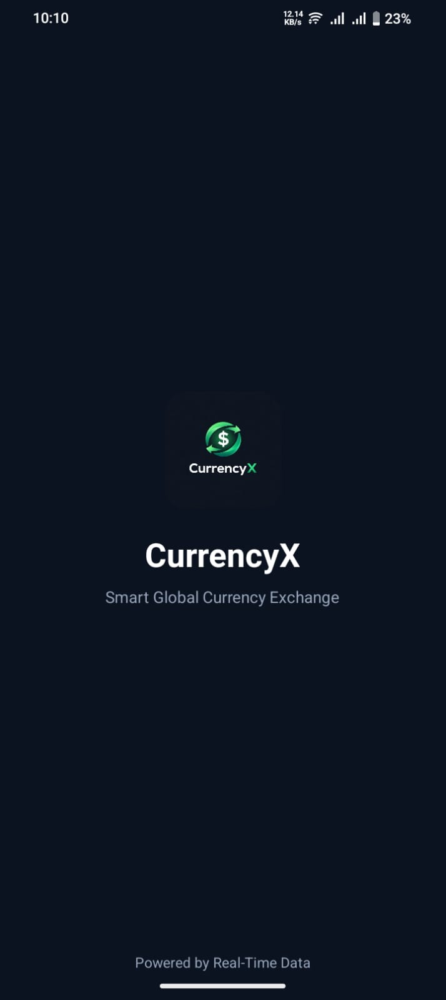
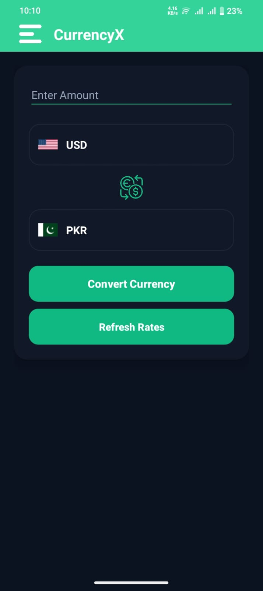
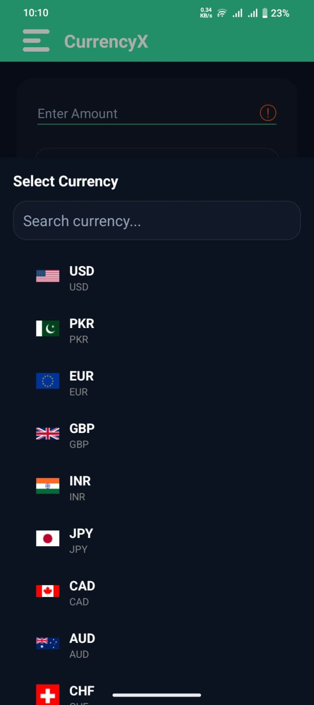
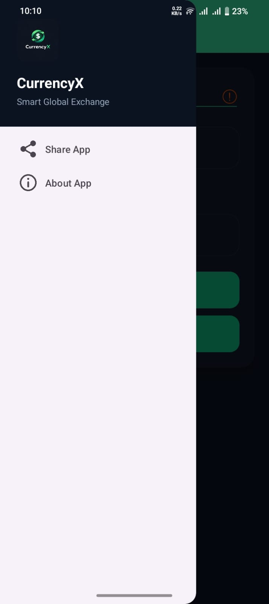
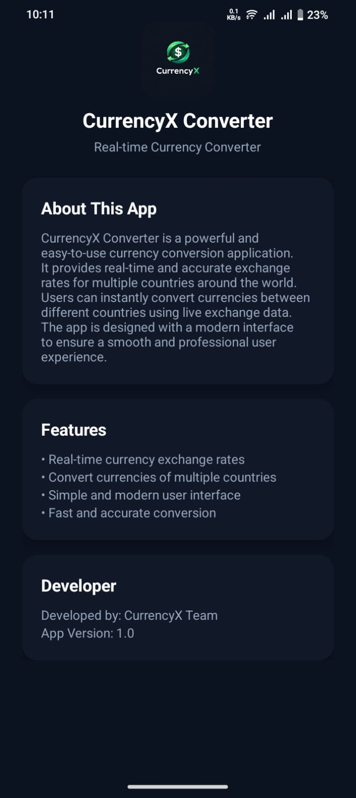

# CurrencyX - Real-Time Currency Converter

CurrencyX is a modern Android currency converter application that provides **accurate real-time exchange rates** for multiple international currencies.

The app is designed with a **clean fintech-style UI** and allows users to quickly convert currencies between different countries using live exchange data.

---

# Features

• Real-time currency exchange rates  
• Convert multiple global currencies  
• Clean and modern UI design  
• Country flag indicators  
• Fast and accurate conversion  
• Simple navigation drawer  
• Currency selection with search  

---

# App Preview

## App Graphic

---

## Splash Screen

---

## Main Currency Converter

---

## Currency Selection

---

## Navigation Drawer

---

## About App Screen

---

# Download APK

You can download the latest APK from the repository.
